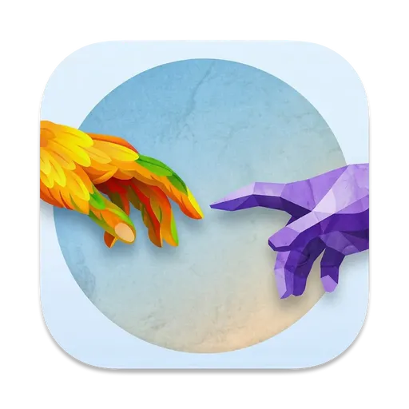
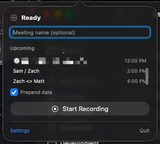
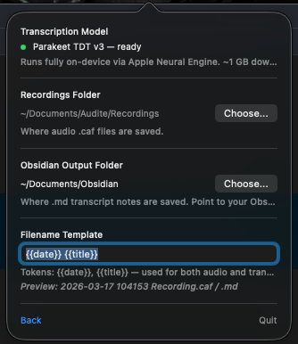

<p align="center">
  
</p>

<h1 align="center">Audite</h1>

<p align="center">
  A macOS menu-bar app that records meetings and transcribes them locally into Markdown notes for Obsidian.
</p>

---

## Screenshots

| | |
|---|---|
|  |  |

## Features

- **Fully local transcription** — uses [FluidAudio](https://github.com/FluidInference/FluidAudio) (Parakeet TDT v3) running on Apple Neural Engine. No audio leaves your machine.
- **Menu-bar native** — lives in the status bar, stays out of your way
- **Obsidian integration** — saves transcripts as `.md` files with YAML frontmatter, directly into your vault
- **Calendar integration** — shows upcoming Apple Calendar events, click to use as the recording title
- **Configurable output** — separate folders for audio recordings and transcript notes, customizable filename templates with `{{date}}` and `{{title}}` tokens

## Requirements

- macOS 14.0+
- Apple Silicon (M1+) recommended for fast transcription via Neural Engine
- ~1 GB disk space for the transcription model (downloaded on first use)

## Building

Requires [XcodeGen](https://github.com/yonaskolb/XcodeGen) and Xcode 15.4+.

```bash
brew install xcodegen
xcodegen generate
xcodebuild -scheme Audite -configuration Debug -derivedDataPath build build
open build/Build/Products/Debug/Audite.app
```

## Usage

1. Click the waveform icon in the menu bar
2. Go to **Settings** and download the transcription model (~1 GB, one-time)
3. Set your **Recordings Folder** (where `.caf` audio goes) and **Obsidian Output Folder** (where `.md` notes go)
4. Type a meeting name or pick one from your calendar
5. Hit **Start Recording** — hit **Stop Recording** when done
6. The transcript saves automatically as a Markdown note

## License

MIT
